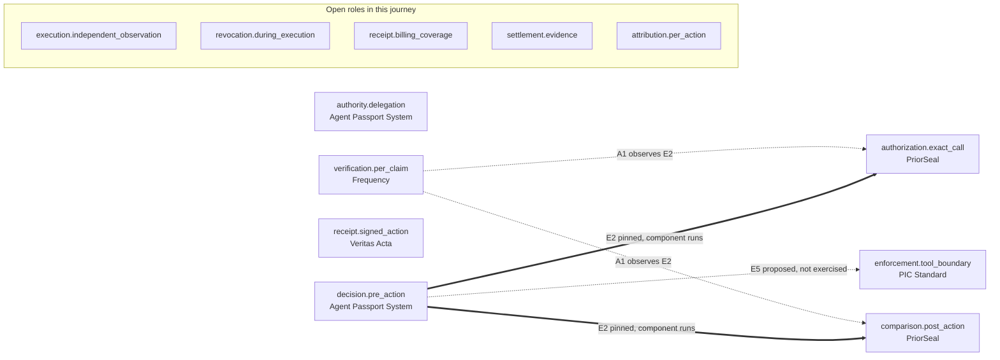

<!-- generated by scripts/build-map.js from map/, do not edit -->
# Shared systems map (prototype)

Proposed and non-normative. Listing is a description, not membership, approval or agreement to shared governance. A role with no implementation here is not represented in this map, which says nothing about whether it exists elsewhere. Role identifiers are local to this map.

## Journey: One paid tool call that must stay within a delegated per-action spend limit.

Status: **candidate composition**. End-to-end run: **none**. An end-to-end result needs execution evidence for the assembled path at the recorded pins.

Only declared edges are drawn. Steps inside one project have no edge.

| role | job | implementation | via | state and limits |
|---|---|---|---|---|
| `authority.delegation` | Issue scoped authority from a principal to an agent, narrowing at each transfer. | Agent Passport System |  | within one project |
| `decision.pre_action` | Decide permit or deny for one proposed action before it runs and emit a signed decision record. | Agent Passport System |  | within one project |
| `authorization.exact_call` | Bind an external decision to the exact call parameters before execution. | PriorSeal | E2 | pinned, see edge. Limits: APS signatures are under published test keys, observations are synthetic and no transaction is sent |
| `enforcement.tool_boundary` | Allow or block the call at the protected tool, using external authority as evidence. | PIC Standard | E5 | connection proposed not exercised. Limits: how external evidence enters a PIC Action Proposal is not defined yet |
| `execution.independent_observation` | Record which call actually executed, observed by a party other than the actor. | none in this map |  | role unrepresented |
| `comparison.post_action` | Compare an observed call with what was authorized and report each mismatch separately. | PriorSeal | E2 | pinned, see edge. observations are synthetic. Limits: APS signatures are under published test keys, observations are synthetic and no transaction is sent |
| `revocation.during_execution` | Make a revocation that lands after authorization stop or flag a call that has not executed yet. | none in this map |  | role unrepresented. APS publishes ancestor revocation fixtures but no record here shows a revocation reaching a call already authorized at PriorSeal |
| `receipt.signed_action` | Emit a signed receipt for a performed action that a third party can verify offline. | Veritas Acta |  | interface missing |
| `receipt.billing_coverage` | Before money moves, check that every billed item has a signed receipt and none is missing. | none in this map |  | role unrepresented. proposed by Veritas Acta as E6 consumer |
| `settlement.evidence` | Settle payment after an action and emit verifiable settlement evidence that references the action. | none in this map |  | role unrepresented |
| `attribution.per_action` | Record which projects' artifacts one action consumed, with evidence a reader can check. | none in this map |  | role unrepresented. a Frequency schema proposal exists |
| `verification.per_claim` | Re-check pinned artifacts from its own implementation and report one result per claim. | Frequency | A1 | pinned, see edge. preflight only. Limits: APS trust pins equal the fixture's published test keys, preflight only, formal run not run or published, each scope confirmation is by one side, review repository carries a review only notice |

## Edges

### A1 (assurance)

Frequency per-claim results over the E2 pinned artifacts.

- Proposed by @altrudev: [link](https://github.com/aeoess/agent-governance-vocabulary/issues/177#issuecomment-5885842512)
- Pins: [altrudev/Frequency-Federation-Review@4162622a](https://github.com/altrudev/Frequency-Federation-Review/tree/4162622af24c94efb843f53aa27940ffd1256ad6) (tag `aps-priorseal-v0.1.1-review`), v0.1.1 preflight revision, [altrudev/Frequency-Federation-Review@cf738909](https://github.com/altrudev/Frequency-Federation-Review/tree/cf7389097fe3a404b3557da2e72fdd8cbe962b81) (tag `aps-priorseal-a1-exec-2026-10-02`), designated A1 review execution commit, [altrudev/Frequency-Federation-Review@a4056226](https://github.com/altrudev/Frequency-Federation-Review/tree/a40562268aa1d6e1f6d369e296c16261d623c4e0) (tag `aps-priorseal-a1-instructions-2026-10-02`), RUN.md documentation commit for the A1 run
- Scope confirmations, each by one side: priorseal by @imokokok ([link](https://github.com/aeoess/agent-governance-vocabulary/issues/177#issuecomment-5952032554)), aps by @aeoess, conditional ([link](https://github.com/aeoess/agent-governance-vocabulary/issues/177#issuecomment-5956876272))
- Limits: APS trust pins equal the fixture's published test keys, preflight only, formal run not run or published, each scope confirmation is by one side, review repository carries a review only notice
- Does not establish: formal pilot result, live execution, independent witness, adoption
- Evidence:
  - `ev-a1-preflight-author` preflight by @altrudev, development preflight, explicitly not the formal pilot result, not independent. Source: [link](https://github.com/aeoess/agent-governance-vocabulary/issues/177#issuecomment-5935328122). Not reviewed by the map editors. Results as emitted: ESTABLISHED 14, CONTRADICTED 3, NOT_ESTABLISHED 5.
  - `ev-a1-preflight-rerun-aeoess` preflight rerun by @aeoess, local only, not published, not independent. Source: local, 2026-10-01, fresh clone per capsules/aps-priorseal-v0.1/RUN.md at 4162622a. Reviewed by aeoess on 2026-10-01 at 4162622a, fresh clone, RUN.md command, exit 0. Results as emitted: ESTABLISHED 14, CONTRADICTED 3, NOT_ESTABLISHED 5. Trust pins for APS equal the fixture's own published test keys, so signature claims mean valid under those keys.

### E2 (runtime)

APS decision evidence (decision_ref) carried into a PriorSeal exact-call authorization, then compared with a synthetic observation.

- Proposed by @imokokok: [link](https://github.com/aeoess/agent-passport-system/issues/163)
- Pins: [aeoess/agent-passport-system@948f99b8](https://github.com/aeoess/agent-passport-system/tree/948f99b85343bef2c6fa677c8543965caacfc087) (tag `fixtures/priorseal-decision-binding-v1`), [imokokok/PriorSeal@d749d269](https://github.com/imokokok/PriorSeal/tree/d749d2691c3e6be139de4020e7b27cdafca2c428)
- Field mappings: `aps.decision_ref` to `priorseal.context_commitment` partial, unconfirmed; `aps.spend.per_action` to `priorseal.exact_call.value` partial, unconfirmed
- Limits: APS signatures are under published test keys, observations are synthetic and no transaction is sent
- Does not establish: independently observed execution, live APS currency at execution, decision single use, production use
- Evidence:
  - `ev-e2-lab-run` component run by @aeoess, merged 2026-10-02 (aca2ff0c), interop/priorseal-aps-payment-limit-d749d269/, independent for priorseal signatures verify, exact call versus observation. Source: [link](https://github.com/Agent-Authority-Conformance/aps-conformance-suite/pull/139). Not reviewed by the map editors. Results as emitted: within_limit COMPLIANT, over_limit NON_COMPLIANT TRANSACTION_VALUE_MISMATCH.
  - `ev-e2-priorseal-modea` component run by @imokokok, merged with lab PR 139 as independent-entry1-imokokok.md, independent for aps evidence verifies. Source: [link](https://github.com/Agent-Authority-Conformance/aps-conformance-suite/pull/139#issuecomment-5901343345). Not reviewed by the map editors.

### E5 (runtime)

APS authority for one bounded synthetic MCP action, checked at the protected tool.

- Proposed by @madeinplutofabio: [link](https://github.com/aeoess/agent-governance-vocabulary/issues/177#issuecomment-5890595191)
- Pins: none
- Limits: how external evidence enters a PIC Action Proposal is not defined yet
- Does not establish: anything, not exercised
- Evidence: none

## Projects

| project | maintainer | description from | maintainer confirmation | limits |
|---|---|---|---|---|
| [Agent Passport System](https://github.com/aeoess/agent-passport-system) | @aeoess | editors, pending maintainer confirmation | pending | fixture keys are published test keys, no live deployment represented |
| [Frequency](https://github.com/altrudev/Frequency-Federation-Review) | @altrudev | editors, from the capsule at aps-priorseal-v0.1.1-review | pending | review only notice on the repository, formal run not published |
| [PIC Standard](#) | @madeinplutofabio | editors, from https://github.com/aeoess/agent-governance-vocabulary/issues/177#issuecomment-5890595191 | pending | how external evidence enters a PIC Action Proposal is not defined yet |
| [PriorSeal](https://github.com/imokokok/PriorSeal) | @imokokok | editors, from https://github.com/aeoess/agent-governance-vocabulary/issues/177#issuecomment-5885120538 | pending | observations in the pinned pair are synthetic, no transaction is sent |
| [Veritas Acta](https://github.com/VeritasActa/verify) | @tomjwxf | editors, from https://github.com/aeoess/agent-governance-vocabulary/issues/177#issuecomment-5885617993 | pending | no consuming project named for the billing check |
